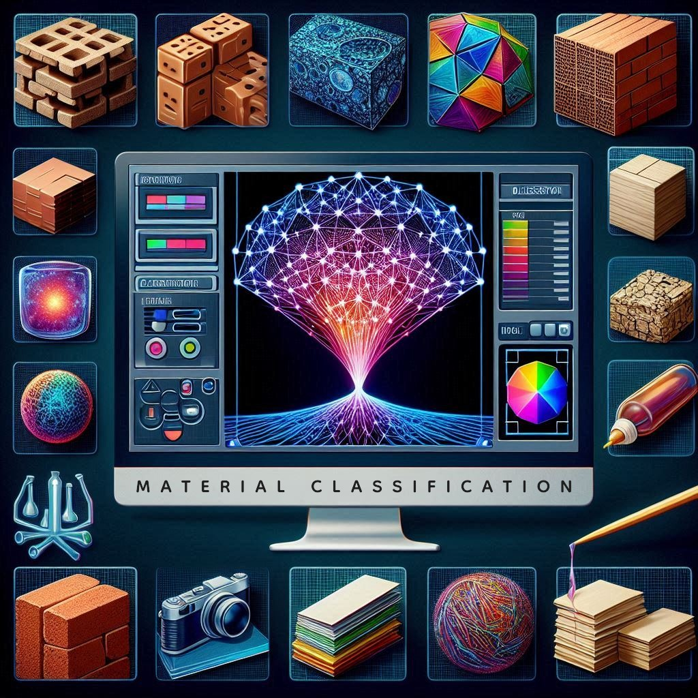

# BWMP2: Dataset RGB para Clasificación de Materiales con un Modelo Fundacional Finamente Ajustado"

  

Este proyecto presenta un modelo fundacional finamente ajustado para la clasificación de materiales. Utilizando un dataset propio de imágenes RGB que contiene cinco clases (Ladrillo, Metal, Madera, Papel, Plástico), el modelo es capaz de identificar y clasificar correctamente una imagen dentro de estas categorías
